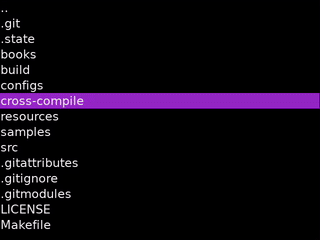

## [Pixel Reader](https://github.com/ealang/pixel-reader)

An ebook reader app for the Miyoo Mini. Supports epub and txt formats.



## Miyoo Mini Installation

Supports Onion, MiniUI, and the default/factory OS.

1. [Download the latest release](https://github.com/ealang/pixel-reader/releases). Make sure to get the correct zip file for your OS. For Onion or default/factory OS: `pixel_reader_onion_xxx.zip`. For MiniUI: `pixel_reader_miniui_xxx.zip`. 
2. Extract the zip into the root of your SD card.
3. Boot your device, and the app should now show up in the apps/tools list.

The default location for book files is `Media/Books`.

## Development Reference

### Desktop Build

Install dependencies (Ubuntu):
```
apt install make g++ libxml2-dev libzip-dev libsdl1.2-dev libsdl-ttf2.0-dev libsdl-image1.2-dev
```

Build:
```
make -j
```

Find app in `build/reader`.

### Miyoo Mini Cross-Compile

Cross-compile env is provided by [shauninman/union-miyoomini-toolchain](https://github.com/shauninman/union-miyoomini-toolchain). Docker is required.

Fetch git submodules:
```
git submodule init && git submodule update
```

Start shell:
```
make miyoo-mini-shell
```

Create app packages:
```
./cross-compile/miyoo-mini/create_packages.sh <version num>
```

### Run Tests

[Install gtest](https://github.com/google/googletest/blob/main/googletest/README.md).

```
make test
```
